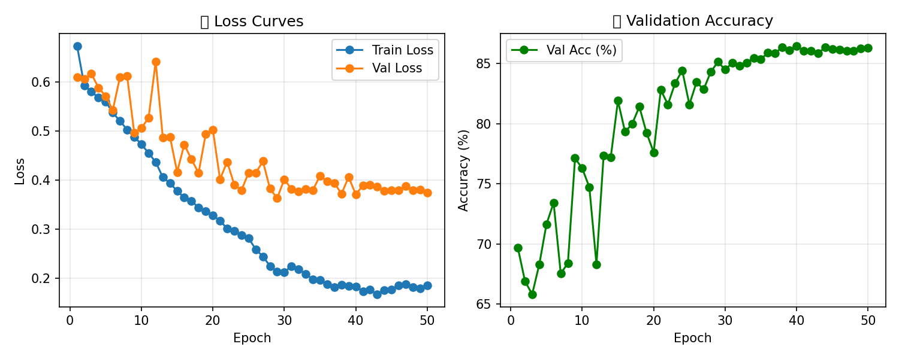

# Alzheimer’s Disease Classification from MRI Slices (AD vs NC)

## 1) Problem
We are classifying Alzheimer’s Disease (AD) vs Normal Control (NC) from 2D MRI brain slices derived from the ADNI dataset. The goal is to learn discriminative patterns that generalise across subjects rather than memorising subject identity. The core challenge is data leakage: multiple slices per subject exist, so improper splitting can inflate validation accuracy without reflecting real generalisation.

### Example input


## 2) Algorithm
I implemented a custom, tiny ConvNeXt-like CNN in PyTorch. Each stage uses depthwise 7×7 convolutions for spatial mixing, LayerNorm, a pointwise 1×1 MLP (expand → GELU → project), and a residual connection. A 4×4 stride‑4 stem performs early downsampling, followed by two stride‑2 downsamplers between stages. Finally, global average pooling and a linear head produce two logits (NC/AD). The network is intentionally small for clarity and quick training.

- Optimizer: AdamW with weight decay
- Scheduler: ReduceLROnPlateau on validation loss
- Regularisation: classifier head dropout
- Augmentation: moderate spatial and photometric transforms on training only

## 3) How it works (high level)
1. Load JPEG slices, group by subject ID (prefix before first underscore).
2. Perform a subject‑level stratified split into train/val/test so no subject appears in more than one split.
3. Apply augmentations to training images; validation/test use deterministic transforms.
4. Train the ConvNeXt‑like model with AdamW. A ReduceLROnPlateau scheduler lowers the LR when val loss stops improving. We checkpoint `last.pt` and `best.pt` and log CSV/PNG metrics.
5. At evaluation, we run the latest checkpoint on the test set and report accuracy.

## 4) Results
- Validation accuracy stabilised around ~86–87% by late epochs.
- Final held‑out test accuracy: 88.11% (3,220 images; 2,837 correct).

### Training curves



### Test results
```
Tested 3220 images.
Correct predictions: 2837
Accuracy: 88.11%
```

## 5) Pre‑processing and split justification
- Image loading: slices are opened with PIL and converted to RGB (`.convert("RGB")`). Grayscale inputs become three identical channels, which keeps transforms and the model’s `in_channels=3` consistent.
- Normalisation: ImageNet mean/std to stabilise optimisation of RGB CNN backbones.
- Training transforms (aug only on train): random resized crop (224×224), horizontal flip (p=0.5), small rotation (±15°), and light color jitter. These simulate plausible variability and reduce overfitting while preserving anatomy.
- Validation/Test transforms: resize to 224×224 + normalise.
- Split justification: the split is by subject (not per slice) to avoid leakage where slices from the same subject appear in both train and val/test. Subject‑level splitting better reflects generalisation to new patients. This is essential for medical imaging datasets with multiple slices per subject.

References (for transform/common practice):
- Dosovitskiy et al., augmentations for vision models; general CNN augmentation heuristics.
- LayerNorm and depthwise conv ideas inspired by ConvNeXt (Liu et al., 2022).

## 6) Dependencies and reproducibility
- Python ≥ 3.10
- PyTorch ≥ 2.2
- torchvision ≥ 0.17
- numpy ≥ 1.24
- pillow ≥ 10.0
- matplotlib ≥ 3.7
- tqdm ≥ 4.64

Reproducibility:
- Fixed random seed (default `--seed 42`).
- Deterministic split by subject using the same seed.
- Logged metrics (`runs/metrics/train_log.csv`, `metrics.json`) and curves (`train_curve.png`).
- Checkpoints: `runs/checkpoints/last.pt` and `best.pt` to resume exactly.

## 7) Example inputs, outputs, and plots
- Input (single slice): 224×224 RGB tensor (from a grayscale JPEG converted to RGB).
- Model output: logits `[logit_NC, logit_AD]`; predicted class is `argmax` (0=NC, 1=AD). For probabilities, apply softmax.

Example inference snippet:
```python
from PIL import Image
import torch
from torchvision import transforms
from src.modules import build_convnext_tiny

img = Image.open("example_input.jpeg").convert("RGB")
transform = transforms.Compose([
    transforms.Resize((224, 224)),
    transforms.ToTensor(),
    transforms.Normalize([0.485, 0.456, 0.406], [0.229, 0.224, 0.225]),
])

x = transform(img).unsqueeze(0)  # [1,3,224,224]
model = build_convnext_tiny(num_classes=2, classifier_dropout=0.3).eval()
with torch.no_grad():
    logits = model(x)
    pred = int(logits.argmax(dim=1))  # 0=NC, 1=AD
```

## 8) Training/Testing commands (examples)
Train (50 epochs, subject split 70/15/15):
  ```bash
  python -u -m src.train \
    --data-root /path/to/AD_NC \
    --epochs 50 \
    --batch-size 32 \
    --lr 1e-4 \
    --weight-decay 1e-4 \
    --classifier-dropout 0.3 \
    --checkpoints-dir runs/checkpoints \
    --plots-dir runs/metrics
  ```

Evaluate on test:
  ```bash
  python -u -m src.predict \
    --data-root /path/to/AD_NC \
    --batch-size 64 \
    --checkpoints-dir runs/checkpoints \
    --predictions-dir runs/test
  ```

---
If needed, subject‑level ensembling (averaging slice probabilities per subject) can be added to produce per‑subject decisions rather than per‑slice predictions.
